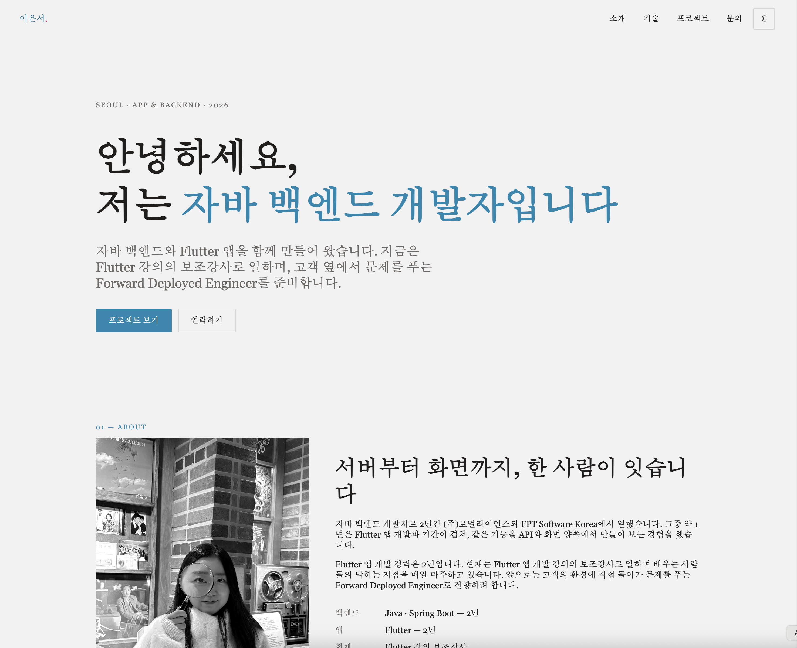
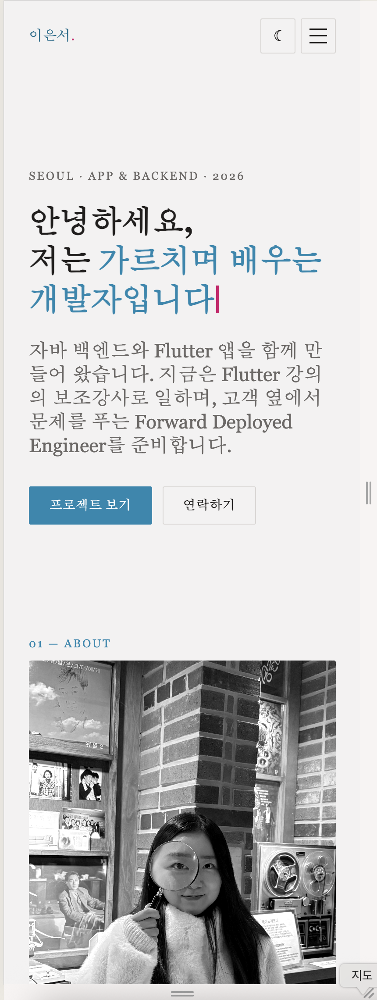
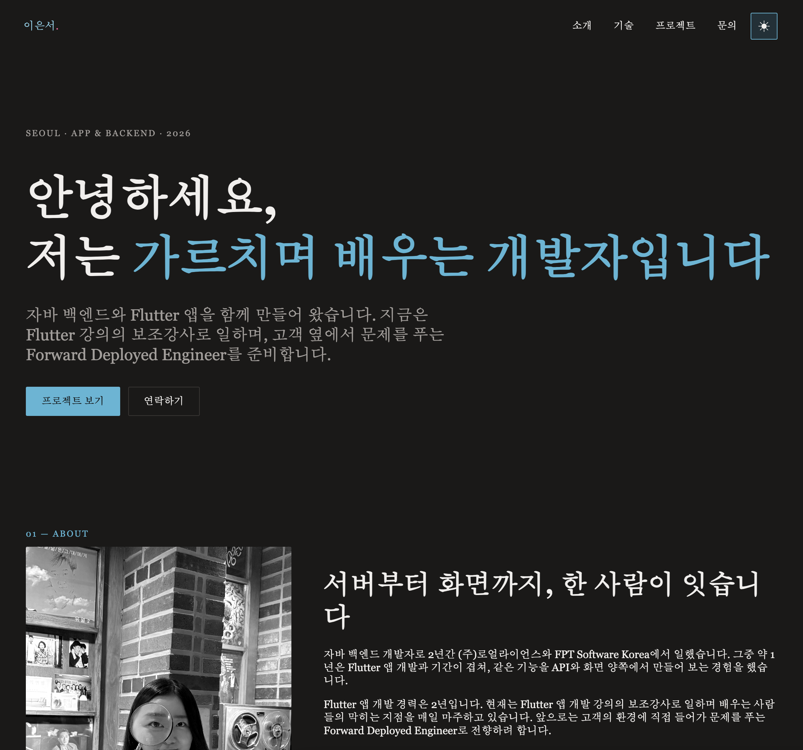

# 이은서 — 반응형 포트폴리오 웹사이트

바닐라 HTML · CSS · JavaScript로 만든 1페이지 반응형 포트폴리오입니다. React 학습 이전에 DOM 조작, 이벤트 처리, 비동기 통신, "이벤트 → 상태 변경 → 렌더링" 흐름을 직접 구현하며 체득하는 것을 목표로 한 학습용 과제입니다.

- **배포 URL**: https://eunseo-415.github.io/my-page/
- **저장소 URL**: https://github.com/Eunseo-415/my-page 

## 스크린샷

| 데스크톱 | 모바일 | 다크 모드 |
| --- | --- | --- |
|  |  |  |

## 사용 기술

- **HTML5**: 시맨틱 태그(`header`, `nav`, `main`, `section`, `footer`) 기반 마크업
- **CSS3**: CSS 변수(`:root`), Flexbox, Grid, 미디어 쿼리(모바일 퍼스트), `prefers-reduced-motion` 대응
- **JavaScript (ES6+)**: `const`/`let`, 화살표 함수, 구조분해 할당, 템플릿 리터럴, `map`/`filter`/`forEach`, `fetch` + `async/await`
- **외부 API**: GitHub REST API (`/users/{username}/repos`)
- **폼 전송(보너스)**: Formspree
- **웹 폰트**: Google Fonts — Source Serif 4
- 외부 UI 프레임워크·라이브러리 미사용 (React/Vue/jQuery/Bootstrap/Tailwind 없음)

## 폴더 구조
```
index.html        마크업 (Hero / About / Skills / Projects / Contact / Footer)
css/style.css     외부 스타일시트 — :root 토큰, 다크 모드, 반응형
js/main.js        인터랙션 — 상태 → 렌더링
images/           프로필 등 이미지 자산
README.md
```

## 기능 요구사항 체크리스트

### 1. 반응형 웹사이트
- [x] 모바일 / 태블릿(768px) / 데스크톱(1024px) 브레이크포인트로 레이아웃 최적화
- [x] Hero, About, Skills, Projects, Contact, Footer 섹션 포함

### 2. 인터랙티브 UI
- [x] 다크 모드 토글 · 햄버거 메뉴 · 부드러운 스크롤 · 스크롤 등장 애니메이션
- [x] Contact 폼 유효성 검사

### 3. 외부 API 연동
- [x] GitHub API에서 본인(`Eunseo-415`) 저장소 목록을 불러와 Projects 섹션에 카드로 렌더링
- [x] 로딩(스켈레톤) / 에러(재시도 버튼) / 빈 상태(안내 문구) UI로 표현

### 4. 상태 유지
- [x] 다크 모드 설정을 `localStorage`에 저장, 새로고침 후에도 유지

### 5. 배포
- [ ] GitHub Pages 배포 후 URL 연결 `<!-- TODO -->`

### 보너스 과제
- [x] 프로젝트 필터링 — GitHub 저장소를 언어별로 필터링하는 버튼 (`array.filter()`)
- [x] 타이핑 효과 — Hero 섹션 문구가 한 글자씩 나타나는 타자기 효과
- [x] 폼 실제 전송 — Formspree 연동으로 Contact 폼이 실제 이메일 전송
- [ ] 시스템 다크 모드 감지 — `prefers-color-scheme` 미반영 (현재는 `localStorage` 저장값 또는 기본 라이트로만 시작)

## 설정값 (`js/main.js` 상단 `CONFIG`)

과제 요구사항의 "기준값은 자유 변경 가능하나 README에 명시" 조건에 따라 아래에 실제 적용한 값을 명시합니다.

| 항목 | 값 | 설명 |
| --- | --- | --- |
| `githubUser` | `Eunseo-415` | Projects 섹션이 불러올 GitHub 계정 |
| `maxRepos` | `6` | 카드로 표시할 저장소 개수 (fork 제외, 최근 push 순) |
| `navThreshold` | **60px** | 이 이상 스크롤하면 네비게이션에 `.scrolled`가 붙어 배경색·블러·그림자가 생김 |
| `topBtnThreshold` | **300px** | 이 이상 스크롤하면 우측 하단 스크롤 탑 버튼이 나타남 |
| `revealThreshold` | **0.2** | Intersection Observer threshold — 섹션이 20% 보이면 등장 애니메이션 실행 |
| `typeSpeed` / `typeHold` | 90ms / 1600ms | Hero 타이핑 효과 속도, 문장 유지 시간 |

## 인터랙션 구현 상세
1. **햄버거 메뉴 토글** — 768px 미만에서 버튼 노출. 클릭 시 `classList.toggle('active')`로 메뉴 표시/숨김, `aria-expanded` 동기화. 메뉴 항목 클릭 시 자동 닫힘.
2. **부드러운 스크롤** — `html { scroll-behavior: smooth }`로 앵커 클릭 시 자동으로 부드럽게 이동. 고정(sticky) 네비 높이만큼 `scroll-padding-top: 72px`로 보정해 섹션 제목이 가리지 않게 함.
3. **스크롤 탑 버튼** — 300px 이상 스크롤 시 `.visible` 부여, 클릭 시 `window.scrollTo({ behavior: 'smooth' })`로 맨 위로 이동.
4. **네비게이션 스타일 변경** — `.nav`를 `position: sticky`로 상단 고정, 60px 이상 스크롤 시 `.scrolled` 클래스가 붙어 반투명 배경 + `backdrop-filter` + 그림자로 전환.
5. **다크 모드** — 토글 클릭 → `theme` 상태 변경 → `<html data-theme>` 갱신 → `[data-theme="dark"]` CSS 변수 적용 → `localStorage`에 저장되어 새로고침 후 유지.
6. **스크롤 애니메이션** — `.reveal` 요소를 Intersection Observer(threshold 0.2)로 감시, 뷰포트 진입 시 `.visible` 부여 후 관찰 해제(1회 실행).

## 상태 → 렌더링 흐름 (React 이전 개념 체득)
"사용자 이벤트 → 상태 변경 → 화면 업데이트" 흐름을 다음 4가지 기능에서 구현했습니다.

1. **다크 모드**: 토글 클릭 → `themeState.theme` 변경 → `renderTheme()` → 전체 화면 스타일 변경 + `localStorage` 저장
2. **GitHub 프로젝트**: `fetch` 호출 → `projState.status`(`loading`/`success`/`error`) 변경 → `renderProjects()`가 스켈레톤·카드 그리드·에러+재시도 중 하나를 렌더
3. **폼 검증**: 입력/blur/제출 이벤트 → 필드별 유효성 상태 계산 → `renderFieldError()`가 에러 메시지 표시/숨김 + `.invalid` 테두리 토글
4. **프로젝트 언어 필터**: 필터 버튼 클릭 → `projState.filter` 변경 → 카드 목록 재렌더 (결과 없으면 안내 문구)

## 폼 UX
이름 · 이메일 · 메시지 모두 필수 입력이며, 이메일은 정규식으로 형식을 검증하고 메시지는 10자 이상을 요구합니다. 에러 메시지는 각 입력 필드 바로 아래에 표시됩니다. 제출은 `event.preventDefault()`로 기본 동작을 막고, 검증을 통과하면 Formspree로 실제 이메일을 전송한 뒤 성공 메시지를 보여줍니다(전송 실패 시 별도 에러 메시지 표시).

## CSS 설계
- 모바일 퍼스트로 작성, 브레이크포인트 **768px(태블릿)** / **1024px(데스크톱)**
- `:root`에 색·폰트·간격·그림자를 변수로 정의하고, `[data-theme="dark"]`에서 색 관련 변수만 재정의
- **네비게이션**: Flexbox (`justify-content: space-between` + 메뉴에 `margin-left: auto` — 로고 왼쪽, 메뉴·아이콘 오른쪽 정렬)
- **Projects 카드**: Grid (`repeat(auto-fit, minmax(260px, 1fr))`)로 화면 폭에 따라 카드 개수 자동 조정
- 버튼 · 카드에 hover 효과 + `transition`, 카드에 `box-shadow`(호버 시 상승 효과)
- `:focus-visible` 포커스 링, `prefers-reduced-motion` 대응

## 학습 목표 자가 점검

- [x] 시맨틱 태그를 사용한 이유와 구조 설계 기준 설명 가능
- [x] Flexbox(네비게이션, 1차원 정렬)와 Grid(카드 그리드, 2차원 반응형 배치)의 차이와 선택 기준 설명 가능
- [x] `querySelector` + `addEventListener`로 이벤트를 연결하는 흐름 설명 가능
- [x] 화살표 함수 · 구조분해 할당 · `map`/`filter` 사용 이유와 방식 설명 가능
- [x] `fetch` + `async/await`로 비동기 데이터를 가져와 로딩/성공/실패 상태를 UI로 표현하는 방식 설명 가능
- [x] "이벤트 → 상태 변경 → DOM 업데이트" 흐름 설명 가능 (React 상태-렌더링 흐름의 기초)
